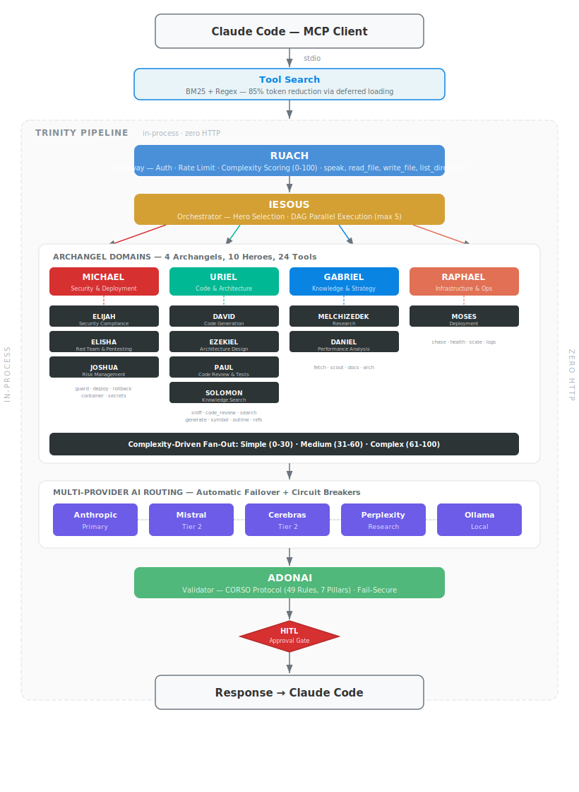
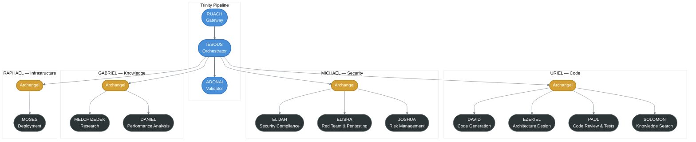

# CORSO

**Security-First AI Orchestration Platform**

CORSO is a production MCP (Model Context Protocol) server and Claude Code plugin built in Rust. It provides 24 tools through a single orchestrator, implements the full MCP specification, and routes AI workloads across multiple providers with automatic failover.

## What It Does

CORSO sits between Claude Code and the user's codebase, providing security scanning, code review, research, performance analysis, and an opinionated build pipeline. It's designed around the idea that AI-assisted development should have safety gates — not just for the code being written, but for the AI operations themselves.

### Key Capabilities

- **24 MCP tools** accessible through a single `corsoTools` orchestrator — speak, guard, fetch, sniff, chase, code_review, scout, and more
- **Full MCP specification coverage** — Tools, Resources (23 URIs across 4 schemes), Prompts (4 HITL workflow templates), and Tasks (async lifecycle with progress tracking)
- **Tool Search** — Implements Anthropic's Tool Search specification with BM25 and Regex search, reducing token consumption 85%+ through deferred tool loading
- **Programmatic Tool Calling (PTC)** — All 24 tools support programmatic invocation alongside natural language
- **Human-in-the-Loop (HITL)** — Approval workflows for high-stakes operations, combining MCP Prompts and Tasks into unified security gates
- **Multi-provider AI routing** — Routes across Anthropic, Mistral, Cerebras, Perplexity, and Ollama with automatic failover and circuit breakers

### Architecture

CORSO uses a Trinity-layered pipeline that executes entirely in-process with zero HTTP overhead:



All three layers are Rust library calls — no microservices, no network hops, single binary deployment.

### Trinity Pipeline

Every request flows through three named layers, each with distinct failure semantics:

| Layer | Name | Role | On Failure |
|-------|------|------|------------|
| 1 | **RUACH** | Gateway — auth, rate limiting, input sanitization, complexity scoring (0-100) | Degrades gracefully |
| 2 | **IESOUS** | Orchestrator — hero selection, DAG-based parallel execution (max 5 concurrent) | Retry with exponential backoff |
| 3 | **ADONAI** | Validator — CORSO Protocol enforcement (49 rules, 7 pillars), security scanning | Fail-secure (deny request) |

### Archangels and Heroes

IESOUS delegates work to **4 Archangels**, each commanding specialized **Heroes**:



### Domain Routing

Every tool call is resolved through a **compile-time static route table** — 24 entries, zero runtime cost. Each entry maps a tool to its owning Archangel, default heroes, and pipeline behavior:

| Tool | Domain | Default Heroes | Behavior |
|------|--------|---------------|----------|
| `guard` | MICHAEL | Elijah, Joshua | Security scan with dynamic hero augmentation |
| `fetch` | GABRIEL | Melchizedek, Daniel | Multi-source research |
| `sniff` | URIEL | Paul, Elijah, Joshua | Code analysis with cross-domain heroes |
| `chase` | RAPHAEL | Daniel, Moses | Performance analysis |
| `scout` | GABRIEL | Daniel | Plan generation |
| `code_review` | URIEL | Paul | Code review with dynamic augmentation |
| `deploy` | MICHAEL | Joshua, Elijah | Deployment with security validation |
| `speak` | RUACH | — | Direct execution (bypasses Trinity) |
| `read_file` | RUACH | — | Direct execution |

Tools marked `direct_execution` skip the Trinity pipeline entirely — no heroes, no ADONAI validation. Tools with `dynamic_selection` allow IESOUS to augment beyond default heroes based on complexity.

**Complexity-driven fan-out**: RUACH scores each request 0-100. This determines how many heroes execute:

| Complexity | Score | Hero Selection | ADONAI Validation |
|-----------|-------|----------------|-------------------|
| Simple | 0–30 | Default heroes only | Skipped |
| Medium | 31–60 | Default heroes | Full pipeline |
| Complex | 61–100 | Default + augmented (max 5 parallel) | Full + extended feedback |

**Intent classification fallback**: For tasks that don't map to a pre-defined tool, the ArchangelRouter classifies intent via keyword scoring and routes to the highest-match Archangel. Unknown intents default to URIEL.

### C0RS0 Pack Build Cycle

CORSO includes a 7-phase build pipeline for structured development:


Each phase has its own skill definition, domain context, and quality gates. Dashed arrows show feedback loops — security findings flow back to code analysis, failed quality gates retry execution, and squad review can trigger rework.

### Tool Reference

All 24 tools are accessible through a single `corsoTools` MCP orchestrator via the `action` parameter:

| # | Tool | Domain | Description |
|---|------|--------|-------------|
| 1 | `speak` | RUACH | General chat and delegation routing |
| 2 | `read_file` | RUACH | Read file contents |
| 3 | `write_file` | RUACH | Write file contents |
| 4 | `list_directory` | RUACH | List directory contents |
| 5 | `sniff` | URIEL | Code analysis and generation |
| 6 | `search_code` | URIEL | Semantic code search |
| 7 | `generate_code` | URIEL | AI-powered code generation |
| 8 | `code_review` | URIEL | Code review with standards enforcement |
| 9 | `find_symbol` | URIEL | Symbol lookup (tree-sitter, deferred) |
| 10 | `get_outline` | URIEL | File structure outline (tree-sitter, deferred) |
| 11 | `get_references` | URIEL | Cross-reference lookup (tree-sitter, deferred) |
| 12 | `guard` | MICHAEL | Security scan — 4,997 vulnerability patterns |
| 13 | `deploy` | MICHAEL | Deployment orchestration |
| 14 | `rollback` | MICHAEL | Deployment rollback |
| 15 | `container_manage` | MICHAEL | Container lifecycle management |
| 16 | `secret_manage` | MICHAEL | Secrets management (locked to Elijah) |
| 17 | `fetch` | GABRIEL | Multi-source research and knowledge retrieval |
| 18 | `search_documentation` | GABRIEL | Documentation search |
| 19 | `analyze_architecture` | GABRIEL | Architecture analysis and design review |
| 20 | `scout` | GABRIEL | Plan generation and strategy |
| 21 | `chase` | RAPHAEL | Performance analysis and benchmarking |
| 22 | `monitor_health` | RAPHAEL | System health monitoring |
| 23 | `scale_resources` | RAPHAEL | Resource scaling |
| 24 | `manage_logs` | RAPHAEL | Log management and analysis |

Tools 9-11 use **deferred loading** — excluded from `tools/list` to reduce token cost, but still callable via `tools/call` and discoverable through Tool Search.

## Plugin Structure

This repository contains the Claude Code plugin layer — the integration code that connects CORSO's MCP server to Claude Code's agent, hook, and skill systems.

```
plugin/
├── .mcp.json                    # MCP server definition
├── .claude-plugin/plugin.json   # Plugin manifest
├── agents/
│   ├── C0RS0.md                 # Primary agent (behavior, tools, protocol)
│   └── TEAM-HELIX.md            # Squad consultation router
├── hooks/
│   ├── hooks.json               # Hook registration (9 hooks)
│   ├── check-mcp.sh             # MCP server health checks
│   ├── plan-gate.sh             # Blocks execution tools during planning
│   ├── phase-gate.sh            # Pipeline state validation
│   ├── security-pre-check.sh    # Pre-scan validation
│   ├── block-destructive.sh     # Blocks dangerous bash commands
│   ├── skill-banner.sh          # Pack-themed skill banners
│   ├── rustfmt-on-save.sh       # Auto-format Rust on save
│   └── quality-check.sh         # Post-write code quality analysis
└── skills/
    ├── CORSO/SKILL.md           # Master skill (603 lines)
    ├── SCOUT/SKILL.md           # Plan generation
    ├── FETCH/SKILL.md           # Research domain
    ├── SNIFF/SKILL.md           # Code analysis domain
    ├── GUARD/SKILL.md           # Security domain
    ├── CHASE/SKILL.md           # Testing domain
    ├── HUNT/SKILL.md            # Plan execution
    └── SCRUM/SKILL.md           # Squad review
```

## Tech Stack

- **Runtime**: Rust (single binary, ~15MB)
- **Protocol**: MCP over stdio (JSON-RPC 2.0)
- **AI Providers**: Anthropic, Mistral, Cerebras, Perplexity, Ollama
- **Observability**: OpenTelemetry → SigNoz
- **Standards**: clippy::pedantic, zero unwrap/panic, mandatory security scans

## Part of Light Architects

CORSO is one of five MCP servers in the Light Architects platform:

| Server | Purpose |
|--------|---------|
| **CORSO** | Security, orchestration, build pipeline |
| [QUANTUM](https://github.com/theLightArchitect/QUANTUM) | Forensic investigation, evidence analysis |
| [EVA](https://github.com/theLightArchitect/EVA) | Personal assistant, memory, code review |
| [SOUL](https://github.com/theLightArchitect/SOUL) | Knowledge graph, shared infrastructure, voice |

All servers share a common `mcp-protocol` crate for type-safe JSON-RPC communication and are instrumented with distributed tracing via OpenTelemetry.

## Author

Kevin Francis Tan — [github.com/theLightArchitect](https://github.com/theLightArchitect)
